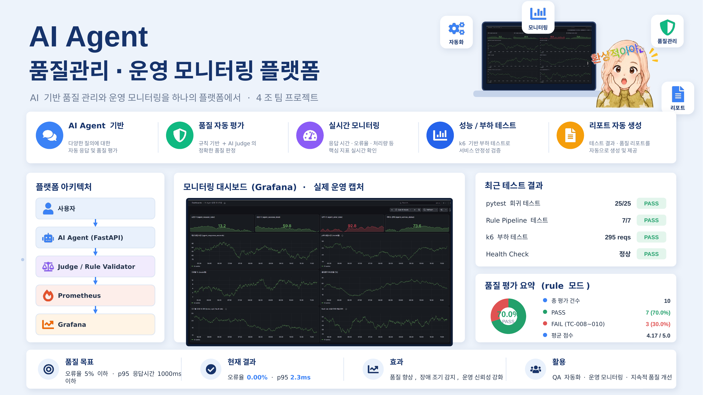
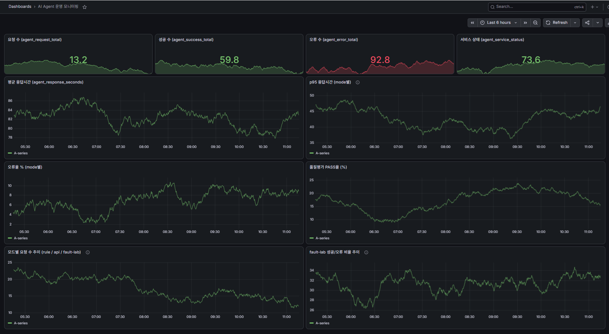
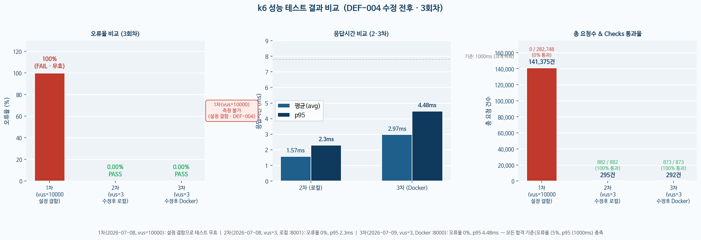

# AI Agent 품질관리·운영 모니터링 플랫폼

> FastAPI 기반 AI 챗봇의 **답변 품질을 자동 검증**하고, 기능 테스트 → 성능 테스트 → 모니터링 → 결함 관리까지  
> **QA 전 과정을 하나로 통합한 운영 플랫폼** — 4조 팀 프로젝트 (SW 품질관리 및 모니터링 실무 과정)



---

## 프로젝트 한 줄 요약

**"기능 테스트 PASS만으로는 부족하다. 성능·모니터링·결함관리까지 검증해야 진짜 운영 가능 판정이 나온다."**

단순한 챗봇 실습이 아니라, *개발 → 테스트 → 품질평가 → 성능검증 → 모니터링 → 배포 → 결함관리*의
실무 품질관리 흐름 전체를 직접 구축하고 검증한 프로젝트입니다.

## 주요 성과

| 영역 | 결과 |
|---|---|
| 기능 테스트 (pytest) | **25/25 전체 PASS** (Health · API · Pipeline · Negative · fault-lab) |
| 품질 파이프라인 (rule 기준선) | **7/7 PASS** (통과율 100%) |
| 성능 테스트 (k6) | 오류율 **0.00%** · p95 **2.3ms** — 기준(5% / 1000ms) 충족 |
| 모니터링 | Prometheus 수집 + Grafana 4패널(요청량·p95·오류율·PASS율) 실시간 관측 |
| 배포 | `docker compose up --build` **1회로 전체 스택 재현** (app + Prometheus + Grafana) |
| 결함 관리 | DEF-001~005 총 5건 발견 → Jira(WT4) 등록·추적 → **전건 Closed** |
| CI | GitHub Actions — push 시 pytest 자동 실행 |
| **최종 판정** | **조건부 운영 가능** (rule 모드 기준 충족 · api 모드는 키/비용 정책 확정 후 확대) |

## 시스템 아키텍처

```
사용자 ──▶ AI Agent (FastAPI)
              │  /ask (rule·api 모드) · /health · /metrics
              ▼
        품질 평가 (Rule Validator + LLM Judge)
              │  /evaluate · /pipeline/run
              ▼
        보고서 생성 ──▶ Jira 결함 등록·추적

  pytest 25건 ──▶ 기능 검증        k6 ──▶ 성능 검증
  FastAPI /metrics ──▶ Prometheus ──▶ Grafana (실시간 대시보드)
```



## 하이라이트 — DEF-004: "서버 장애가 아니라 테스트 장애였다"

1차 k6 부하테스트에서 **141,375건 요청이 100% 실패**했습니다. 서버 결함처럼 보였지만,
원인은 서버가 아니라 **테스트 스크립트의 `vus: 10000` 오설정**(문서 기준값은 `vus: 3`)이었습니다.
로컬 단일 프로세스 서버에 사실상 DoS성 부하를 가한 것이었고, 강제 종료 후에도 8000번 포트가
**좀비 소켓** 상태로 남는 OS 레벨 2차 피해까지 확인했습니다.

1차 실행을 **테스트 무효** 처리하고 설정을 문서 기준값으로 수정해 재실행한 결과 —

| 구분 | 총 요청 | 오류율 | p95 | 판정 |
|---|---|---|---|---|
| 1차 (vus=10000, 수정 전) | 141,375 | **100%** | 측정 불가 | ❌ Fail (무효) |
| 2차 (vus=3, 수정 후) | 295 | **0.00%** | **2.3ms** | ✅ Pass |



> **교훈: 검증 도구와 실행 환경도 테스트 대상이다.**
> 상세 분석: [docs/defect_report.md](docs/defect_report.md) · [performance/results/k6_load_test_report.md](performance/results/k6_load_test_report.md)

## 발견·해결한 결함 (5건, 전건 Closed)

| ID | 결함 | 심각도 | 핵심 조치 |
|---|---|---|---|
| DEF-001 | 규칙 검증기 과잉 설계로 대량 오탐 (합격률 14.3%) | High | 키워드 포함 검사로 단순화 → 7/7 PASS, 회귀 테스트로 상시 감시 |
| DEF-002 | 빈 질문 입력 시 서버 오류 가능성 | Medium | Pydantic 검증으로 422 자동 차단 (설계 단계 예방) |
| DEF-003 | API 키 존재 시 rule 모드 회귀 테스트 비결정성 | High | 회귀 테스트는 키 제거 후 결정론적 fallback 채점으로 고정 |
| DEF-004 | k6 `vus=10000` 오설정 → 오류율 100% + 좀비 소켓 | High | vus=3 수정 후 재실행 → 오류율 0%, p95 2.3ms |
| DEF-005 | Docker Compose 포트 충돌 → 컨테이너 불완전 생성 | Medium | 선점 스택 정리 + `--force-recreate` 재생성으로 정상 복구 |

## 프로젝트 구조

```
├── app/                  # FastAPI AI Agent 서비스
│   ├── main.py           #   /health /ask /evaluate /pipeline/run /metrics
│   ├── service_agent.py  #   답변 생성 (rule / api 모드)
│   ├── judge_agent.py    #   LLM Judge 채점 (+ 규칙 기반 fallback)
│   ├── rule → knowledge_base.py, fault_lab.py, metrics.py, schemas.py ...
├── quality/              # 품질 파이프라인 (규칙 검증 · 보고서 생성 · 테스트 케이스)
├── tests/                # pytest 25건 (health / api / pipeline / negative / fault-lab)
├── performance/          # k6 부하 테스트 스크립트 + 결과 보고서
├── monitoring/           # prometheus.yml · Grafana 대시보드 JSON
├── dashboard/            # Streamlit 품질 리포트 대시보드
├── docs/                 # 테스트 계획 · 결함 보고서 · 성능 보고서 · 최종 품질 보고서
├── assets/               # 인포그래픽 · Grafana 캡처 · k6 결과 차트
├── .github/workflows/    # GitHub Actions CI (push 시 pytest 자동 실행)
├── Dockerfile / docker-compose.yml
└── requirements.txt
```

## 실행 방법

### 로컬 실행

```bash
pip install -r requirements.txt
cp .env.example .env              # OPENAI_API_KEY 입력 (없어도 rule 모드는 동작)

uvicorn app.main:app --reload     # API 서버 → http://localhost:8000/docs
pytest -v                         # 자동 테스트 25건
python -m quality.quality_pipeline            # 품질 파이프라인 (CLI)
streamlit run dashboard/streamlit_app.py      # 품질 대시보드
k6 run performance/k6_test.js                 # 성능 테스트 (서버 기동 상태에서)
```

### Docker 실행 (전체 스택 1회 재현)

```bash
docker compose up --build
# app: http://localhost:8000  /  Prometheus: :9090  /  Grafana: :3000 (admin/admin)
```

## API 요약

| 메서드 | 경로 | 설명 |
|---|---|---|
| GET | `/health` | 서버 상태 확인 |
| POST | `/ask` | 질문 → 답변 (mode: rule / api) |
| POST | `/evaluate` | 답변 1건 즉시 평가 (규칙 + Judge) |
| POST | `/pipeline/run` | 전체 케이스 회귀 실행 + 보고서 생성 |
| GET | `/metrics` | Prometheus 지표 노출 |
| POST | `/fault-lab` | 장애 재현 (normal · delay · error500 · timeout) |

## 장애 처리 설계

- 빈 질문·형식 오류 → Pydantic 검증으로 **422** 즉시 차단
- `OPENAI_API_KEY` 미설정 상태의 api 모드 → **503** (fail-fast)
- Judge 호출 실패 → **규칙 기반 fallback** 평가로 파이프라인 지속
- 장애 실습용 `/fault-lab`로 500·지연·타임아웃을 의도적으로 재현하고, Grafana 지표 반응 검증

## 문서

| 문서 | 내용 |
|---|---|
| [docs/test_plan.md](docs/test_plan.md) | 테스트 계획 (수준 1~6 설계) |
| [docs/defect_report.md](docs/defect_report.md) | 결함 보고서 DEF-001~005 상세 |
| [docs/performance_report.md](docs/performance_report.md) | 성능 테스트 계획·기준 |
| [performance/results/k6_load_test_report.md](performance/results/k6_load_test_report.md) | k6 실행 결과 (1차 무효 → 2차 PASS) |
| [docs/final_quality_report.md](docs/final_quality_report.md) | 최종 품질 판정 보고서 |

## 향후 과제

1. **Rule 지식 확장 + RAG 연동** — 커버리지 확대 및 API 의존·비용 절감
2. **Golden Answer 이중 검증** — LLM Judge 오평가 완충 체계
3. **평가 로그 시계열 적재** — 전일 대비 품질 변화 자동 리포트 (LLMOps)

## 기술 스택

`Python 3.12` · `FastAPI` · `pytest` · `k6` · `Prometheus` · `Grafana` · `Streamlit` · `Docker Compose` · `GitHub Actions` · `Jira`

## 팀 (4조)

| 역할 | 담당 |
|---|---|
| 프로젝트 총괄 / 개발 | 백성현, 김용균 |
| QA / 품질관리 | 박선영 |
| Dashboard 구현 | 백성현, 김용균, 유현주 |
| 발표 / 시연 | 유현주 |
